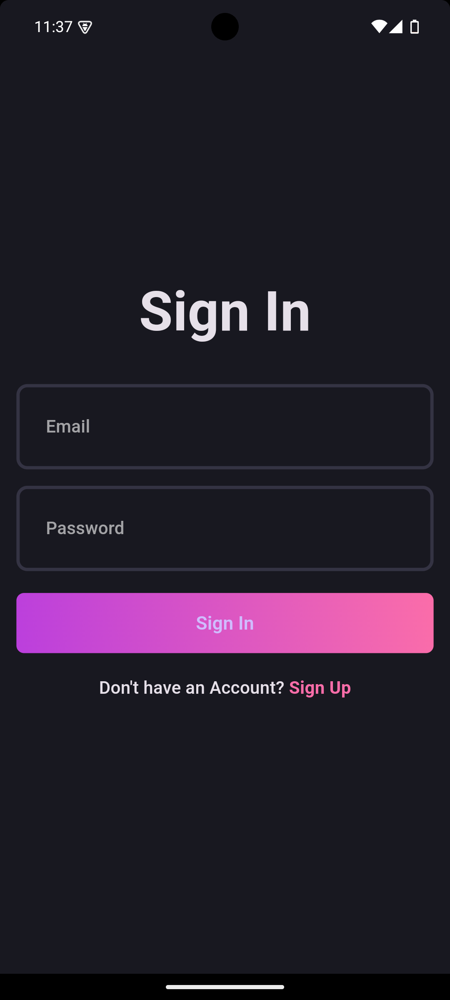
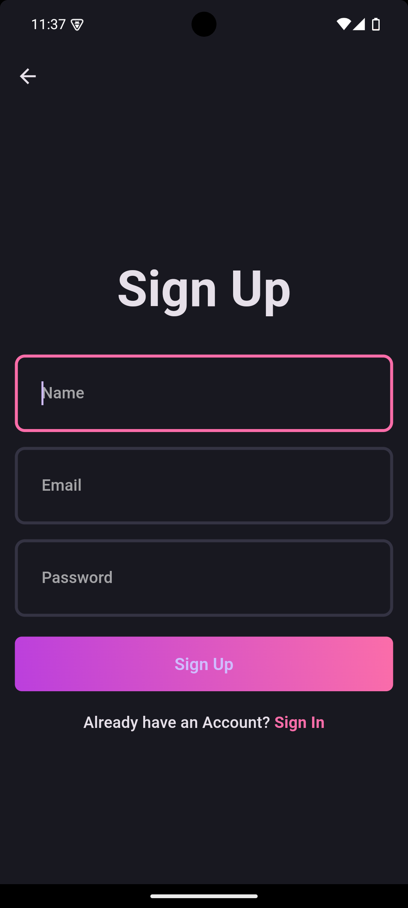
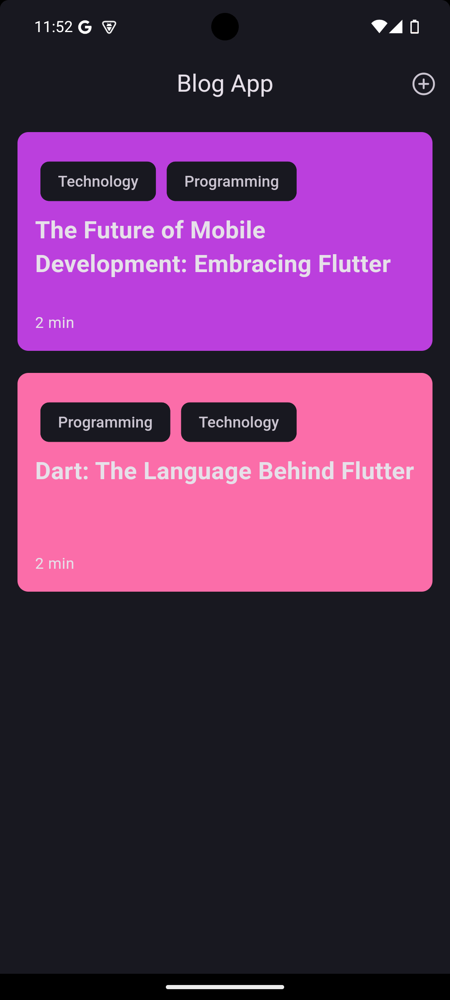
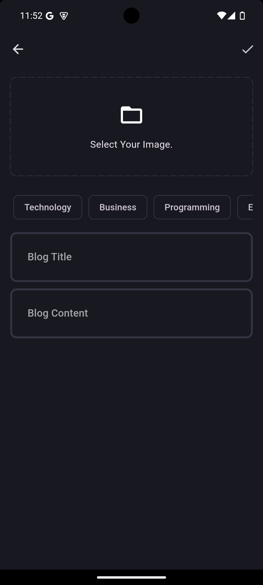
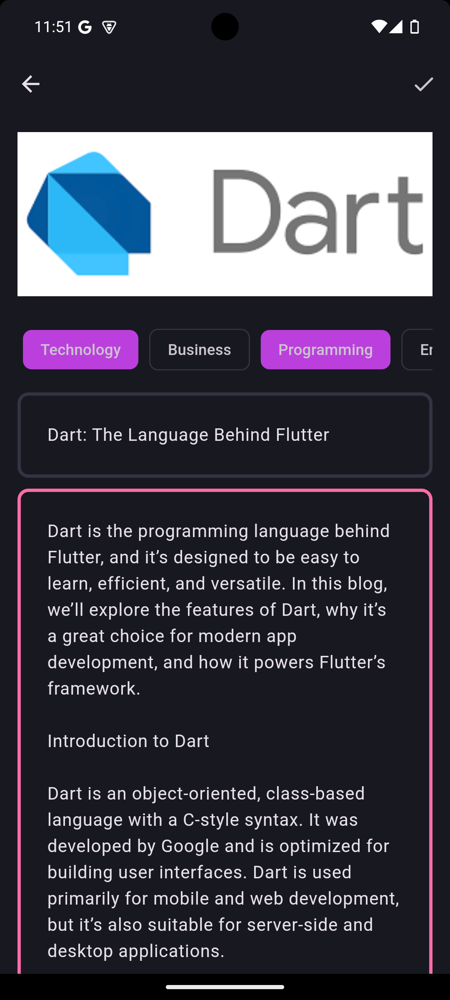
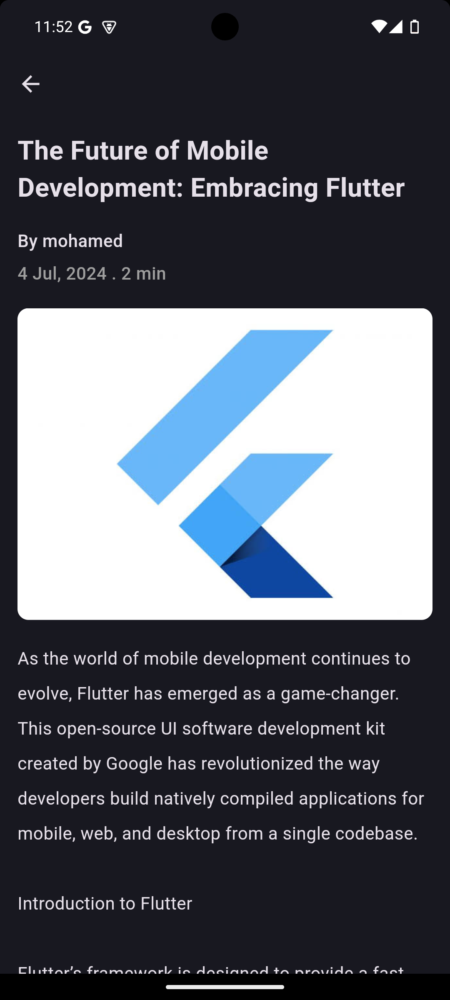

# Blog App Project

This project is a comprehensive Flutter-based blog application built with a focus on Clean Architecture and SOLID principles. The app uses Bloc & Cubit for state management, Supabase for backend services, and `get_it` for dependency injection.

## Table of Contents

- [Introduction](#introduction)
- [Screenshots](#screenshots)
- [Features](#features)
- [Project Setup](#project-setup)
- [App Flow](#app-flow)
- [Architecture](#architecture)
  - [Data Layer](#data-layer)
  - [Domain Layer](#domain-layer)
  - [Presentation Layer](#presentation-layer)
- [SOLID Principles](#solid-principles)
- [State Management](#state-management)
- [Backend Setup with Supabase](#backend-setup-with-supabase)
- [Dependency Injection](#dependency-injection)
- [Local Storage](#local-storage)
- [Testing](#testing)
- [Conclusion](#conclusion)

## Introduction

This project demonstrates how to build a blog application using Flutter. It emphasizes Clean Architecture and SOLID principles to ensure a scalable and maintainable codebase. The app uses Bloc & Cubit for state management, Supabase for backend services, and `get_it` for dependency injection.

## Screenshots

Here are some screenshots of the application:

### Login Page

### Signup Page

### Blog List

### Create Blog

### Blog Detail

## Features

- User Authentication (Sign Up and Sign In)
- Create, Read, and Display Blog Posts
- Image Upload for Blog Posts
- Responsive UI
- Persistent Auth State
- Offline Storage with Hive

## Project Setup

1. **Flutter Installation**: Ensure Flutter is installed on your machine.
2. **Clone the Repository**: `git clone <repository-url>`
3. **Install Dependencies**: Navigate to the project directory and run `flutter pub get`.
4. **Run the App**: Use `flutter run` to start the application on your preferred device or emulator.

## App Flow

The app flow includes user authentication (Sign Up and Sign In), creating new blog posts, and viewing existing posts. Users can upload images for their blog posts and view them in a user-friendly UI.

## Architecture

The project follows Clean Architecture principles, divided into three main layers: Data, Domain, and Presentation.

### Data Layer

- **Remote Data Source**: Handles API calls using Supabase.
- **Local Data Source**: Manages local data storage using Hive.
- **Repository Implementation**: Implements repository interfaces to provide data to the Domain layer.

### Domain Layer

- **Entities**: Core objects representing the business model.
- **Repositories**: Abstract classes defining data operations.
- **Use Cases**: Business logic operations encapsulated in use cases.

### Presentation Layer

- **Pages**: Different screens for the app (e.g., Login, Signup, Blog List, Blog Detail).
- **Widgets**: Reusable UI components.
- **State Management**: Using Bloc & Cubit to manage the app's state.

## SOLID Principles

The app adheres to SOLID principles to ensure a clean and maintainable architecture:

- **Single Responsibility Principle**: Each class has one responsibility.
- **Open/Closed Principle**: Classes are open for extension but closed for modification.
- **Liskov Substitution Principle**: Subclasses can replace base classes without affecting the functionality.
- **Interface Segregation Principle**: Clients should not be forced to depend on interfaces they do not use.
- **Dependency Inversion Principle**: High-level modules depend on abstractions, not on low-level modules.

## State Management

The app uses Bloc & Cubit for state management, providing a predictable state management solution:

- **Bloc**: For complex state management scenarios.
- **Cubit**: For simpler state management needs.

## Backend Setup with Supabase

Supabase provides the backend services for this application, including user authentication, database management, and real-time capabilities. The setup includes:

- **User Authentication**: Managing user sign-up and login.
- **Database**: Storing blog posts and user data.
- **Storage**: Managing image uploads for blog posts.

## Dependency Injection

The `get_it` package is used for dependency injection, ensuring a clean and maintainable codebase:

- **Service Locator Pattern**: `get_it` is used to register and locate dependencies throughout the app.

## Local Storage

Hive is used for local storage to persist data such as user sessions and cached blog posts:

- **Hive**: A lightweight and fast key-value database written in pure Dart.

## Conclusion

This project showcases how to build a scalable and maintainable blog application using Flutter, Clean Architecture, and SOLID principles. By leveraging Bloc & Cubit for state management, Supabase for backend services, and `get_it` for dependency injection, the application maintains a clean and maintainable codebase. Feel free to explore the codebase and adapt the structure to your own projects.
